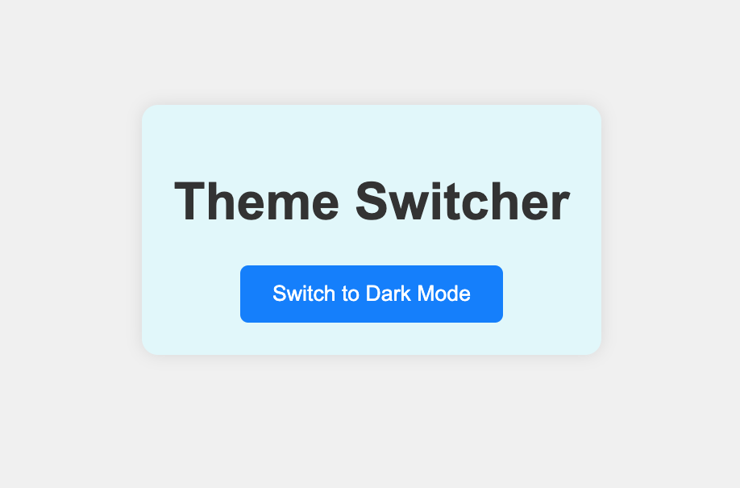

# Javascript-DOM-practice-exercises
## Overview
This project is a collection of small but useful interactive JavaScript features built with plain HTML, CSS, and JavaScript. It includes:

1. **Text Style Changer (index/script)** 
   Change font size, color, and family using dropdowns.

2. **Character Counter (index2/script2)**  
   Tracks remaining characters (limit 200)

3. **List Manager (index3/script3)**  
   Add, mark complete, edit, and delete tasks.

4. **Table Filter (index4/script4)**  
   Live-search functionality to filter rows in a table.

5. **Image Carousel (index5/script5)**  
   Scroll through images with next/previous buttons.

6. **Theme changer (index6/script6)**  
   Toggle site theme with persistent localStorage setting.

## Screenshots 

### 1. Font Style Changer

### 2. Character Counter

### 3. To-Do List

### 4. Table Filter

### 5. Image Carousel

### 6. Dark/Light Mode

